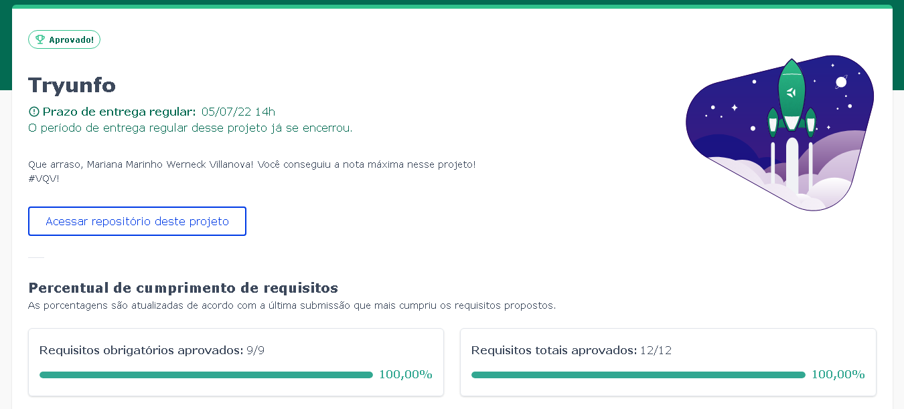

# Projeto Tryunfo! 

Nesse projeto foi criado uma aplicação baseada no jogo de cartas Super Trunfo, utilizando React, CSS, Javascript.

## Desempenho:

O projeto Trynfo foi  desenvolvido por [Mariana Werneck](https://www.linkedin.com/in/marinhomariana8/) durante o curso de Desenvolvimento Web na [Trybe](https://www.betrybe.com/)! Foi adquirido 100% do projeto total.

## Preview:

## Connect:

 